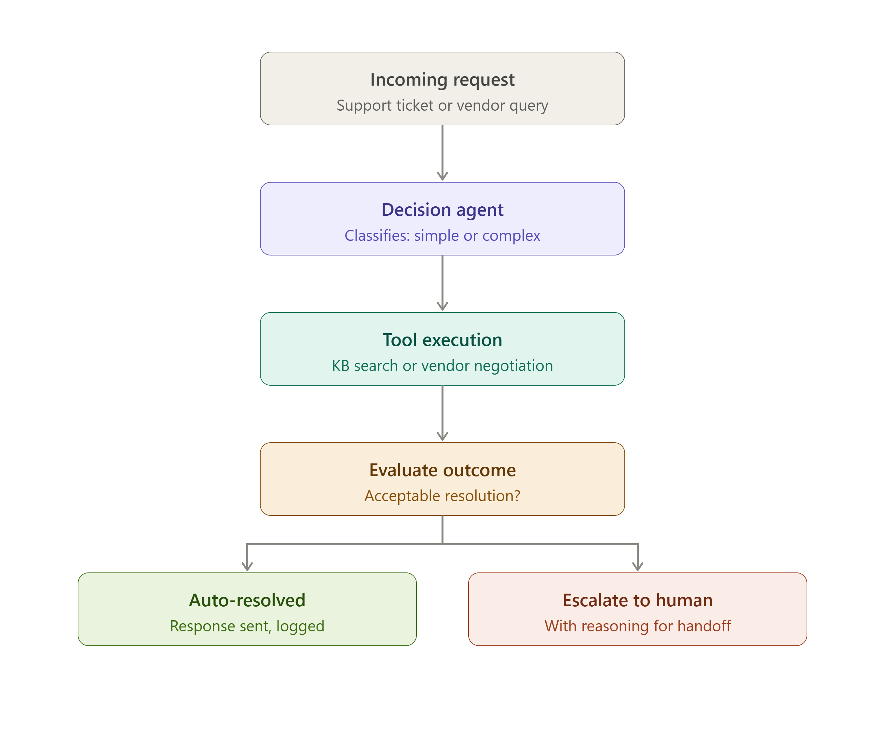

# Architecture

Business context: a single agent serving an online retail business —
handling customer support tickets (orders, refunds, delivery) and vendor
procurement negotiation (packaging, logistics, warehousing supplies).

## Flow

1. **Incoming request** — support ticket or vendor query
2. **Decision agent** — classifies the request as simple or complex
3. **Tool execution** — KB search (support) or vendor negotiation (procurement)
4. **Evaluate outcome** — checks if the resolution is acceptable
5. **Outcome** — either **auto-resolved**, or **escalated to a human** with reasoning

Same loop for both domains: **Observe → Decide → Act → Evaluate → Adapt.**
Only the tool called in the "Act" step differs based on `request_type`.

## Diagram

## Acceptance rules (see `demo/evaluator_criteria.md` for full detail)
- **Support:** accepted only if a real keyword match is found in the
  knowledge base and the request is actually about our store/order/account
- **Vendor:** accepted only if `quoted_price <= threshold_price * 1.05`
  (within a 5% auto-approve buffer)

## Why this counts as agentic, not a chatbot
- The agent chooses which tool to call based on the request (dynamic action
  selection)
- It evaluates its own output against a real threshold before responding
  (evaluation, not just generation)
- When the outcome fails evaluation, it changes course and escalates with
  explicit reasoning instead of returning a wrong or overconfident answer
  (adaptation)